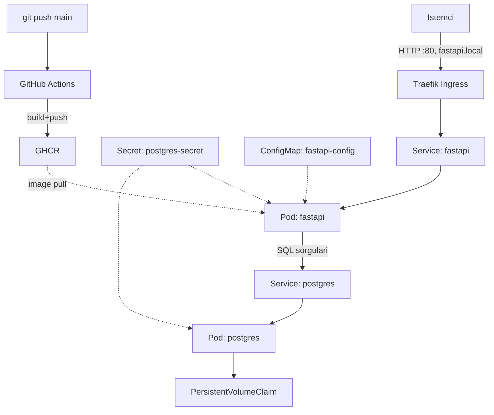

# K3s ile Deploy Edilmiş FastAPI + PostgreSQL Uygulaması

Bu proje bir CRUD API'den daha fazlası — amacı, production-grade Kubernetes
pratiklerini (Deployment, Service, Ingress, Secret/ConfigMap yönetimi,
readiness probe'ları, resource limits, CI/CD) gerçek bir sistem üzerinde
uçtan uca uygulamak. FastAPI + PostgreSQL, bu pratikleri göstermek için
seçilmiş minimal bir "vehicle" — CRUD'un kendisi mimari kararların odağı
değildi, Kubernetes'in kendisiydi.

Bu README, sadece "nasıl çalıştırılır"ı değil, neden bu şekilde
tasarlandığını da anlatıyor.

## Mimari

## Kullanılan Teknolojiler

| Teknoloji | Neden |
|---|---|
| FastAPI | Async destekli, hafif bir Python web framework |
| PostgreSQL | İlişkisel veritabanı, kalıcı state gerektiren bir bileşen örneği |
| asyncpg | Async, düşük seviyeli PostgreSQL sürücüsü (ORM bilinçli tercih edilmedi) |
| Docker | Container image'ları oluşturmak için |
| K3s | Hafif, tek-node Kubernetes dağıtımı |
| Traefik | K3s'e bundled gelen Ingress controller |
| GitHub Actions | CI — image build + push otomasyonu |
| GHCR | Container registry, GitHub Actions ile doğal entegrasyon |

## Proje Yapısı

kubernetes-homelab/
- app/ — FastAPI uygulaması (main.py, database.py, models.py)
- k8s/ — Kubernetes manifestleri (namespace, secret, pvc, deployment, service, ingress, configmap)
- .github/workflows/ — CI (docker-build.yml)
- Dockerfile, docker-compose.yml — local geliştirme
- PROGRESS.md — geliştirme günlüğü

## Kurulum ve Çalıştırma

### Local geliştirme (Docker Compose)

    cp .env.example .env
    docker compose up -d --build
    curl http://localhost:8003/ready

### Kubernetes (K3s)

    kubectl apply -f k8s/namespace.yaml
    kubectl apply -f k8s/postgres-secret.yaml
    kubectl apply -f k8s/postgres-pvc.yaml
    kubectl apply -f k8s/postgres-deployment.yaml
    kubectl apply -f k8s/postgres-service.yaml
    kubectl apply -f k8s/fastapi-configmap.yaml
    kubectl apply -f k8s/fastapi-deployment.yaml
    kubectl apply -f k8s/fastapi-service.yaml
    kubectl apply -f k8s/fastapi-ingress.yaml

FastAPI image'ı GHCR'den otomatik çekilir (ghcr.io/olmez17/kubernetes-homelab-web:latest).
Her push, GitHub Actions ile yeni bir image build edip GHCR'ye gönderir.

Test için `/etc/hosts`'a ekle:

    echo "127.0.0.1 fastapi.local" | sudo tee -a /etc/hosts
    curl http://fastapi.local/ready
    curl http://fastapi.local/items

## API Endpoint'leri

| Method | Path | Açıklama |
|---|---|---|
| GET | / | Health check |
| GET | /ready | Readiness probe — gerçek SELECT 1 sorgusu ile DB baglantisini dogrular |
| POST | /items | Yeni kayit olusturur |
| GET | /items | Tum kayitlari listeler |
| DELETE | /items/{item_id} | Kaydi siler; kayit yoksa 404 doner |

## Mimari Kararlar ve Gerekçeleri

**StatefulSet yerine Deployment (PostgreSQL için).** StatefulSet, replikalar
arasında kimlik ve sıralama garantisi sağlar (primary/replica gibi farklı
rollere sahip pod'lar için). Bu projede PostgreSQL tek replika olarak
çalıştığı için bu garanti hiçbir fayda sağlamıyor — sadece gereksiz
karmaşıklık ekler. Kalıcılık ihtiyacı zaten PVC ile karşılanıyor, bu karar
StatefulSet/Deployment seçiminden bağımsız bir eksen.

**ORM yerine ham SQL (asyncpg).** Bu projenin amacı bir veri modeli/ORM
öğrenmek değil, Kubernetes'in kendisiydi. CRUD, container'lar arası iletişimi
kanıtlamak için var olan minimal bir "vehicle" — bu yüzden SQLAlchemy gibi
bir soyutlama katmanı yerine doğrudan asyncpg ile parametreli SQL sorguları
tercih edildi.

**Async DB sürücüsü (senkron değil).** FastAPI tek bir event loop üzerinde
çalışır. Senkron bir DB çağrısı bu event loop'u bloke eder — hem gecikmeye
hem de sık çağrılan readiness probe gibi endpoint'lerde gereksiz pod
restart'larına yol açabilir. asyncpg ile bu risk ortadan kaldırıldı.

**Local image import'tan CI/CD'ye geçiş.** Geliştirmenin erken aşamasında,
image K3s'e docker save + k3s ctr images import ile manuel taşındı
(imagePullPolicy: Never). Bu, registry'ye bağımlılık olmadan hızlı iterasyon
sağladı. Roadmap'in ilerleyen aşamasında GitHub Actions + GHCR ile bu süreç
otomatikleştirildi (imagePullPolicy: Always), manuel adım tamamen ortadan
kalktı.

**livenessProbe bilinçli olarak eklenmedi.** Bu basit bir CRUD uygulaması,
process hang/deadlock riski taşıyan bir eşzamanlılık karmaşıklığı yok.
readinessProbe (gerçek bir DB sorgusu ile) yeterli bir sağlık sinyali
sağlıyor. Production'a taşınırken, DB'den bağımsız bir livenessProbe
(örn. / endpoint'i) eklenebilir.

## Troubleshooting

### Pod CrashLoopBackOff durumunda

    kubectl logs <pod-adi> -n homelab
    kubectl describe pod <pod-adi> -n homelab

Bu projede yaşanan gerçek bir örnek: FastAPI'nin okuduğu env variable
isimleri (DB_USER) ile Secret'ın key isimleri (POSTGRES_USER) uyuşmadığı
için asyncpg, None kullanıcı adıyla bağlanmaya çalışıp OS kullanıcı adına
(appuser) düşmüştü. Çözüm: env variable isimlerini Secret/ConfigMap key
isimleriyle birebir eşleştirmek.

### PVC Pending durumunda

    kubectl describe pvc <pvc-adi> -n homelab

WaitForFirstConsumer mesajı görürsen, bu bir hata değil — local-path storage
class, PV'yi hangi node'da oluşturacağını bilmek için önce PVC'yi kullanacak
bir Pod'un varlığını bekler. Deployment uygulanınca kendiliğinden çözülür.

### Image ImagePullBackOff durumunda

Local geliştirmede imagePullPolicy: Never kullanılıyorsa, image'ın
docker save + sudo k3s ctr images import ile containerd'e aktarıldığından
emin ol — Docker'ın image store'u ile K3s'in containerd'i birbirinden
habersiz, ayrı depolama alanlarıdır.

CI ile deploy edilen image için: ghcr.io prefix'inin doğru yazıldığından ve
GHCR paketinin Public olduğundan emin ol.

### Service'e bağlanılamıyorsa

Geçici bir debug pod'u ile DNS çözünürlüğünü test et:

    kubectl run debug --image=busybox -n homelab --restart=Never --command -- sleep 3600
    kubectl exec -it debug -n homelab -- sh
    nslookup <service-adi>
    wget -qO- http://<service-adi>:<port>/ready

## CI/CD Akışı

main branch'ine her push:
1. GitHub Actions tetiklenir (.github/workflows/docker-build.yml)
2. Docker image build edilir
3. Image ghcr.io/olmez17/kubernetes-homelab-web:latest olarak GHCR'ye push edilir
4. K3s'teki Deployment, imagePullPolicy: Always sayesinde bir sonraki
   rollout'ta güncel image'ı çeker

## Geliştirme Günlüğü

Projenin adım adım nasıl geliştirildiği, karşılaşılan hatalar ve öğrenilen
kavramlar için [PROGRESS.md](./PROGRESS.md) dosyasına bakabilirsin.
